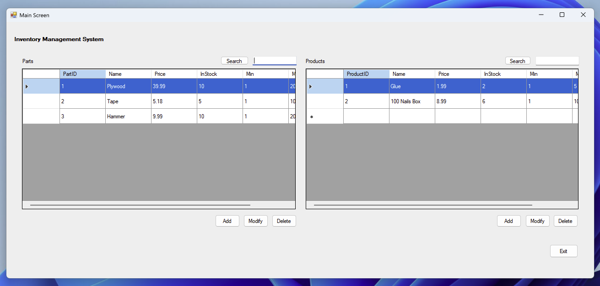
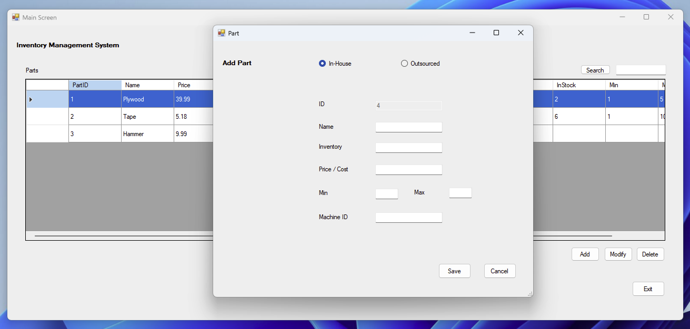
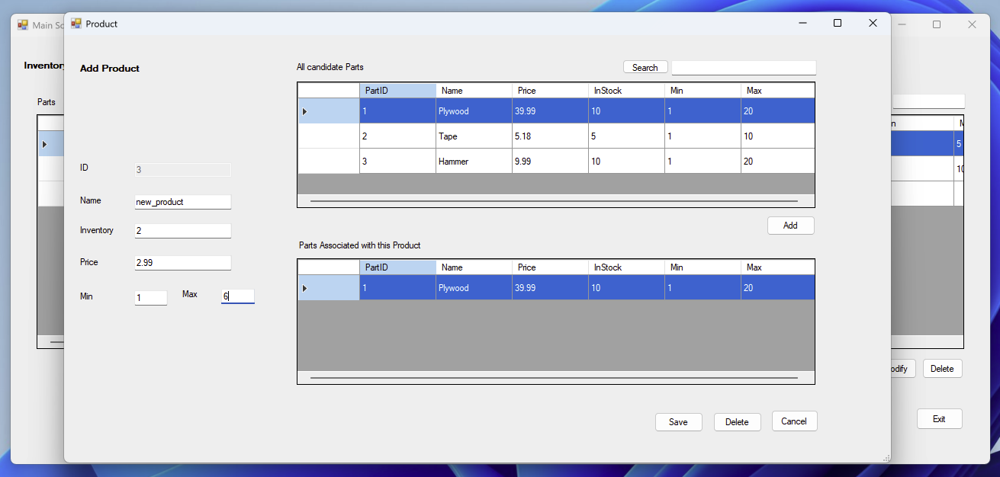

# Inventory Management System (WinForms C#)

This is a desktop inventory management application built with **C# and Windows Forms**. It allows users to manage parts and products with full **CRUD functionality**, search, and validation.

**Note:**
This application was developed for a **school project** with **Visual Studio 2022** on a **Windows 11 (Virtual Machine)** using **Parallels Desktop** on a **Macbook**.
 

## Features

- Object-Oriented Programming (OOP)
- Language Integrated Query (LINQ)
- Data Binding with `BindingList<T>`
- Fully dynamic UI with `DataGridView` controls
- Input validation

#### In App Features:
- Add, modify, delete, and search for **Parts** and **Products**
- Associate parts with products
- Confirmation dialogs for deletions
- Live search by ID or name

 

## Technologies

- **C#**
- **WinForms .NET Framework (4.7.2)**
- **Windows Forms Designer**

 

## Screenshots

| Main Form | Add Part Form | Add Product Form |
|-----------|------------------|------------------|
|  |  |  |

